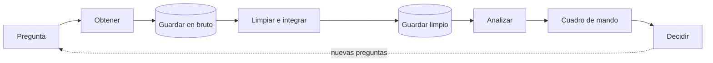

# MP5074 · Sistemas de Big Data

**Curso de especialización en Inteligencia Artificial y Big Data** · IES Fernando Wirtz Suárez · Curso 2026-27

Este módulo enseña a **integrar, procesar, analizar y visualizar grandes volúmenes de datos** para apoyar la toma de decisiones en empresas y organizaciones. A lo largo del curso seguiremos siempre el mismo recorrido del dato:

## Unidades didácticas

-   UD1 **[Introdución ao Big Data](ud1/index.md)**

    ---

    Nuevo paradigma y metodologías de trabajo. Montamos el entorno: WSL, Miniconda, JupyterLab, Git y Docker.

    *1ª evaluación · semanas 1–3*

-   UD2 **[Orixes de datos](ud2/index.md)**

    ---

    Obtención y tratamiento de datos de distintos tipos y orígenes: ficheros, APIs, web scraping e integración con pandas.

    *1ª evaluación · semanas 4–9*

-   UD3 **Xestión, análise e visualización de datos**

    ---

    MongoDB, Hadoop y Spark, análisis con pandas, visualización y modelos predictivos.

    *2ª evaluación · semanas 10–16 · próximamente*

-   UD4 **Cadros de mando**

    ---

    Business Intelligence y cuadros de mando con Power BI para la toma de decisiones.

    *2ª evaluación · semanas 16–20 · próximamente*

## Organización del módulo

| | |
|---|---|
| **Duración** | 100 horas · 120 sesiones de 50 minutos · 6 sesiones por semana |
| **Evaluaciones** | 1ª: UD1 + UD2 · 2ª: UD3 + UD4 |
| **Normativa** | Real Decreto 279/2021 (BOE-A-2021-7686) |

## Evaluación

- Cada evaluación tiene al menos una **prueba escrita** (teoría y práctica), con recuperación en el examen final.
- Nota de cada evaluación: **20 % tareas + 80 % prueba escrita**. La nota final es la media de las dos evaluaciones.
- Si alguna prueba escrita tiene una nota **inferior a 5**, la calificación final será la menor de ellas, con un máximo de 4,0.
- No presentarse a una prueba sin justificación válida supone un cero en esa prueba.
- Las prácticas **entregadas fuera de plazo o copiadas** se califican con un cero.
- Cualquier práctica puede tener que **defenderse**. Una práctica hecha con IA (LLM, Copilot…) que no se sabe explicar se evalúa como copiada.
- En las pruebas **no se permite** el uso de IA.

!!! tip "Antes de empezar"
    Sigue los [manuales de la UD1](ud1/manuales/index.md) en orden: WSL → Miniconda → JupyterLab → Git → Docker. Todas las prácticas del módulo dan por hecho que tienes ese entorno funcionando.
